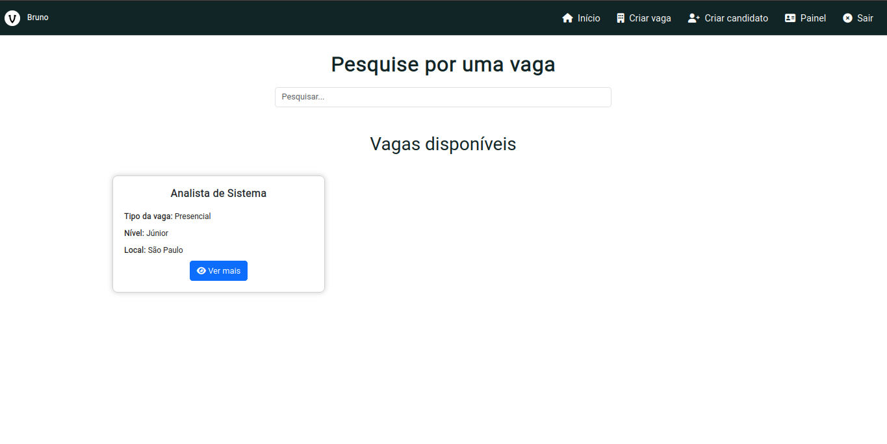
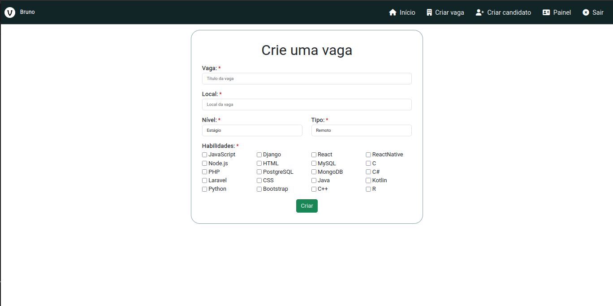
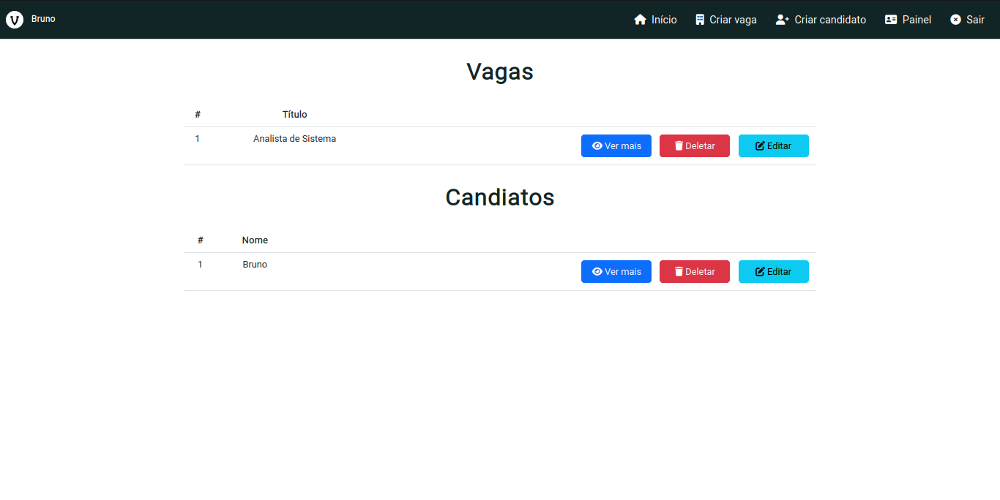
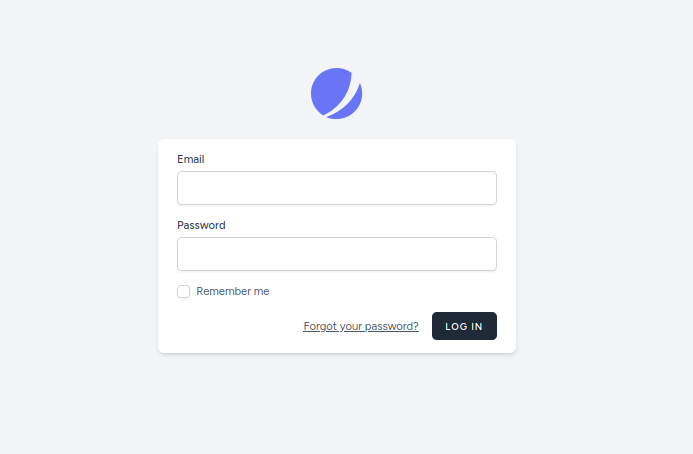
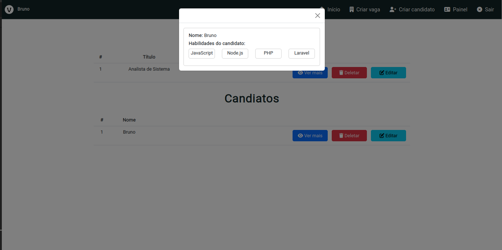
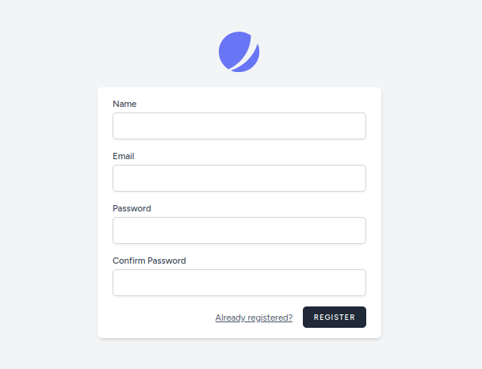
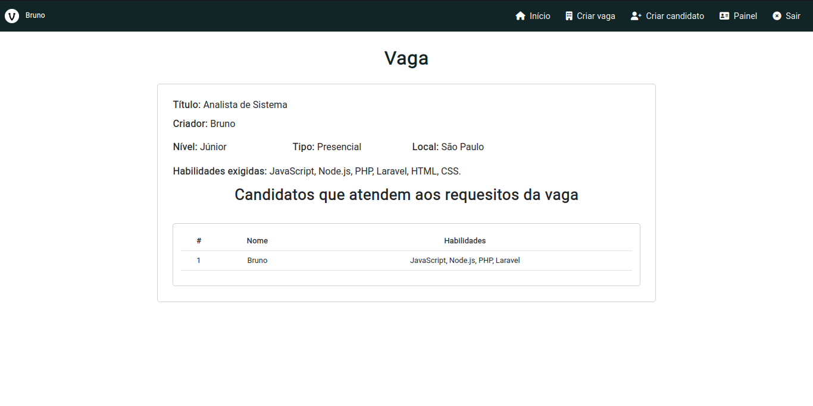

## 📌 Desafio

Este desafio consiste na implementação de uma aplicação PHP utilizando o framework Laravel. O objetivo da aplicação é controlar o processo de seleção de candidatos a vagas de emprego.

## 📐 Implementação

- CRUD vagas; ✅
- CRUD candidatos; ✅
- É preciso haver uma página para exibir a relação de vagas cadastradas e para cada vaga, quais candidatos atendem aos requesitos da vaga; ✅
- Um candidato e uma vaga pode ter no mínimo 3 (três) habilidades; ✅
- Um candidato atende a uma vaga se ele possui pelo menos 3 (três) habilidades exigidas para a vaga; ✅  
Será considerado um diferencial a implementação dos seguintes itens:
- Criar atenticação de usuários usando os recursos do Laravel; ✅
- Utilizar uma biblioteca frontend de sua preferência; ✅
- Inserir o projeto num container docker; ✅

## 📚 Alguns dos materiais utilizados

- CSS (Cascading Style Sheets)
- JS (JavaScript)
- Artisan (Auxilia na criação dos models, migrations, etc)
- Blade (Auxilia a manusear as views)
- Eloquent (ORM - Object-Relational Mapping)
- XAMPP (https://www.apachefriends.org/pt_br/index.html)
- Laravel (https://laravel.com/)
- Bootstrap (https://getbootstrap.com/)
- Composer (https://getcomposer.org/)
- Jetstream (https://jetstream.laravel.com/)
- Livewire (https://laravel-livewire.com/)

## 📁 Projeto
### 📍 Fazendo o clone do repositório:

    git clone https://github.com/brunnuscz/desafio-php-laravel.git

### 📍 Atenção aos comandos necessários para que o projeto funcione corretamente, lembre de rodar todos dentro da pasta `projeto`:
### 1 - Tenha o <a href="https://www.apachefriends.org/pt_br/index.html">XAMPP</a> e o <a href="https://getcomposer.org/">Composer</a> instalado na sua máquina. Deixe o `Apache` e o `MySQL` ativo no `XAMPP`. Para instalar o `Composer` no seu projeto, rode o comando a seguir.

    composer install
    
### 2 - Após rodar o comando abaixo, edite o arquivo `.env` com informações do banco de dados.
    
    php -r "copy('.env.example', '.env');"
    
### 3 - Por fim rode o comando abaixo.
    
    php artisan key:generate
    
### 📍 Para criar as tabelas rode o comando a seguir, lembre de já ter criado o banco de dados:

    php artisan migrate

### 📍 É preciso ter o `Node.js` instalado na máquina para seguir em frente. 
### 1 - Rode o comando a seguir para instalar o `npm`.

    npm install
    
### 2 - Por fim rode o comando abaixo, e deixe rodando em um terminal.

    npm run dev

### 📍 Após isso basta abrir um outro terminal, certifique que está na pasta `projeto` e rode o comando a seguir, vai mostrar o servidor em execução, agora é só acessar a porta no navegador:

    php artisan serve

### 📍 Screenshots

